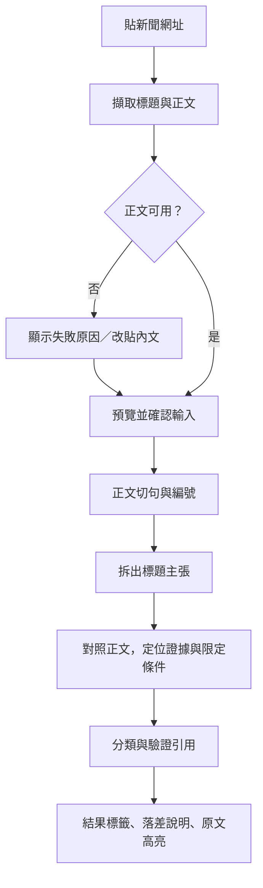

# 標題照妖鏡：精簡版專案計劃書

版本：v2.0｜日期：2026-09-19｜成員：Eric、Max

本版取代 v1.0 作為開發依據。核心範圍改為「單篇新聞的標題與內文一致性」，不做外部查證。這是計劃調整，尚未修改應用程式。

## 1. 專案目標

使用者輸入新聞網址，系統擷取該篇標題與完整正文，判斷標題是否擴大適用範圍、提高確定性，或與內文存在明確矛盾，並顯示對應原句與說明。

一句話介紹：

> 幫助讀者看見新聞標題省略的關鍵條件，所有提示都能回到這篇文章的原文檢查。

判斷的是「內文是否支持標題」，不是新聞事件在現實世界是否真實，也不是作者是否有詐騙意圖。標題吸睛不等於誤導；內文沒有證據不等於標題必然錯誤。

目標使用者為瀏覽財經與科技新聞、希望快速核對標題說法的讀者。作品用於兩人協作開發及 AI 工程師實習面試。

## 2. 本版明確移除的功能

- 外部證據搜尋、其他報導比對、官方公告查證。
- 跨來源可信度判斷、轉載來源鏈與來源分歧分析。
- 公司追蹤清單、自動新聞發現、每日排程與通知。
- 事件聚合、歷史事件更新及向量資料庫。
- 財經數字清單、成長率驗算與投資分析。
- 多人會員系統、多代理協作與大型模型自行部署。
- 精確的「詐騙／誇大百分比」。

網頁全文擷取仍保留：使用者貼網址後，由程式取得該篇正文。移除的是自動找新文章與跨文章搜尋，不是讓使用者只能手動貼全文。

## 3. 第一版範圍

| 項目 | 決定 |
|---|---|
| 語言 | 繁體中文 |
| 文章領域 | 先以財經／科技新聞為主 |
| 網站 | 先支援 1～2 個經實測、可使用的來源 |
| 輸入 | 新聞網址；擷取失敗可改貼標題和內文 |
| 證據範圍 | 僅使用該篇正文，不包含標題、相關新聞或其他網頁 |
| 主要落差 | 確定性與適用範圍；其他明確矛盾可記錄，但不擴充獨立數字驗算器 |
| 模型 | 雲端 LLM 完成原型；用人工標註資料微調一個小型分類模型作比較 |
| 介面 | 沿用 FastAPI＋Jinja2＋HTML/CSS/JavaScript，不另建 Streamlit 展示站 |
| 資料 | 保存本文、句子編號、分析結果及模型版本 |
| 上線 | 本機流程穩定後部署 AWS，供示範操作 |

## 4. 使用流程

初期對可容納長度的文章使用完整正文分析，不增加獨立檢索系統。過長或擷取不完整的文章先明確提示限制，不能靜默截斷後做確定判斷。

## 5. 結果設計與判斷標準

### 面向使用者的四類結果

| 結果 | 定義 |
|---|---|
| 內文支持 | 主要主張獲得正文支持，未發現明確落差 |
| 重要條件省略 | 省略不確定性或適用範圍，可能改變理解 |
| 與內文明確衝突 | 同一對象與期間下，標題主張和內文直接不符 |
| 資訊不足 | 正文不完整、主張模糊或證據不足以判斷 |

標題不必包含正文全部資訊；一般摘要式省略不能一律判成誤導。最初只針對確定性和範圍建立具體標註準則。

### 示範案例（皆為虛構）

| 標題 | 內文 | 結果 |
|---|---|---|
| 星河公司確定調漲價格 | 公司正在評估價格調整，尚未決定 | 重要條件省略：確定性被提高 |
| 星河公司全面漲價 | 調整只適用北美部分產品 | 重要條件省略：適用範圍被擴大 |
| 星河公司今年將關閉工廠 | 公司明確表示今年不會關閉該工廠 | 與內文明確衝突 |
| 星河公司宣布新產品 | 公司今日宣布推出新產品 | 內文支持 |
| 星河公司即將裁員 | 正文只有公司歷史與背景，未談及裁員 | 資訊不足 |

### 畫面內容

1. 原始標題與來源網址。
2. 文章發布時間（找不到就未知）與本次擷取時間。
3. 結果標籤及簡短說明。
4. 每個標題主張與對應證據句。
5. 原文高亮，讓使用者檢查上下文。
6. 資料不足或模型處理失敗的明確提示。

不做「50% 以上就是誇張」的任意門檻。第一版使用分類標籤即可；程度條只是可選的視覺呈現，資訊不足必須獨立顯示，不能放在嚴重度中間。暫不做滑條。

## 6. 必做模組、分工與驗收

| 模組 | 工作內容 | 主責 | 驗收 |
|---|---|---|---|
| M1 全文擷取 | 接收網址、取得標題／日期／正文、逾時和來源限制 | Eric | 固定文章能保留主要段落；失敗不冒充成功 |
| M2 正文整理 | 清除導覽與相關文章、保留段落、切句與編號 | Eric | 證據 ID 可對回保存的正文；標題不混入正文證據 |
| M3 主張與證據分析 | 拆解標題、對照正文、輸出關係和落差類型 | Max | 固定格式可解析，沒有證據時可回傳不足 |
| M4 引用與結果驗證 | 檢查證據 ID、保留原句、輸出說明 | Max | 不存在的 ID 被拒絕；說明不引入其他文章資訊 |
| M5 API 與儲存 | 輸入驗證、分析端點、保存原文與結果、錯誤狀態 | Eric | 端到端可操作，重複操作不產生無限制模型呼叫 |
| M6 結果頁面 | URL／貼文輸入、原文預覽、結果卡片、證據高亮 | Eric | 可展示支持、省略、衝突、資訊不足四種結果 |
| M7 模型實驗 | 人工標註、規則基準、小模型微調、比較與錯誤分析 | Max 主責，Eric 參與 | 固定測試集可重跑比較，清楚呈現限制 |
| M8 部署與文件 | Docker、AWS、密鑰、日誌、README、展示資料 | Eric；簡報共同 | 雲端可操作、資料持久化、可追查失敗 |

證據字串存在只代表引用位置有效，不能保證它真的支持結論；語意正確性須另外人工評估。

## 7. 最小資料結構

第一版使用三組概念即可，不要求建立大量資料表：

### Article

- id、url（手動貼文可留空）、title、source。
- published_at、fetched_at、正文、content_hash、擷取狀態。
- 句子清單：sentence_id、段落編號、原句。

### Analysis

- article_id、分析狀態、分析時間。
- 模型版本、提示詞版本、輸入正文版本／雜湊。
- 主張清單、分類、落差類型、證據 ID、說明。
- 耗時、可取得的 API 用量、錯誤原因。

### Annotation

- 樣本 ID、人工分類、落差類型、證據位置。
- 標註者、分歧與裁決、資料分組。
- 是否人工改寫；與模型輸出分開保存。

若使用者編輯預覽文字，需保存為本次分析的新輸入版本，證據不能指向編輯前的正文。

## 8. 模型開發計劃

### 第一階段：LLM API 原型

對一篇文章完成主張擷取、證據定位與分類。模型只能根據提供的正文分析；將正文視為資料，不遵循其中要求改變任務的指令。

此階段目的是驗證流程、收集錯誤與建立標註方式，不宣稱已自行訓練模型。

### 第二階段：小型模型微調

模型任務限定為「標題主張＋證據片段」的支持／衝突／資訊不足三分類。使用適合中文或多語言的預訓練模型，不從零訓練大型模型。

使用者看到的「重要條件省略」另由確定性／範圍檢查及結構化分析產生，不能把三分類信心直接改名為嚴重程度。若未來要讓小模型直接輸出四種產品結果，需要相應的獨立標註與驗證，不視為第一版必做。

證據片段由人工標註或系統選取會影響表現，因此分開測：

1. 人工正確證據下，分類模型的能力。
2. 系統自行選證據後，完整流程的能力。

### 比較實驗

| 方法 | 目的 |
|---|---|
| 規則基準 | 確定性詞、範圍詞、否定詞等簡單方法 |
| 固定提示詞的 LLM | 可用產品原型與對照 |
| 小型模型微調前／後 | 評估人工標註的效益 |

不保證微調一定優於 LLM。若效果較差，解釋資料量、錯誤類型、速度與成本取捨，也是有效成果。

## 9. 標註與評估

- 先找 5 篇文章跑通流程，再共同標註約 20～30 組主張與證據，確認標準。
- 模型實驗可逐步累積數百組人工審核配對，作為初步微調規模；是否足夠依實驗決定。
- Eric、Max 先各自標同一小批資料，再討論不一致處。
- 同一篇、同事件、轉載和改寫版本放在同一資料分組，避免跨入訓練與測試集。
- 在訓練前固定驗證和測試資料，不用測試集反覆調提示詞。
- 合成案例明確標示，真實案例與合成案例分開報告；原標題也不能自動視為正確標籤。
- 若真實落差案例少，先人工篩選文章；自動抓到 100 篇不代表有 100 篇有用的標註樣本。

必報指標：各類 precision／recall、macro-F1、混淆矩陣、證據選取正確性、誤報與資訊不足案例、單篇耗時及 API 用量。

模型關係分類與最終產品提示分開評估。先建立基準再設定改進目標，不預先聲稱準確率達某個數字。

## 10. 現有程式要改什麼

| 現有部分 | 改造方式 |
|---|---|
| RSSCollector | 保留舊功能，但不作本版核心輸入，也不新增排程 |
| ingestion/ | 新增獨立的 article_fetcher，支援指定網站全文 |
| processing/cleaner.py | 實作正文清理與句子編號 |
| ai/ | 新增 headline_analyzer 與驗證邏輯；舊情緒／主題模組暫不刪除 |
| api/main.py、schemas.py | 新增標題分析輸入、結果與查詢功能 |
| database/ | 保存文章與分析版本，遷移前備份既有資料 |
| dashboard.html、style.css | 改為原文預覽與標題／證據對照；需要時分離 JavaScript |
| tests/、evaluation/ | 測試擷取、引用、API及模型，保存標註和評估腳本 |
| requirements、Dockerfile、README | 補依賴、統一環境、更新用途和啟動方式 |

只改必要部分。舊資料與原有功能的移除另行處理，不因計劃縮減而直接刪除檔案。

## 11. 建議時程

暫以三週核心開發，加一週部署／面試準備作估計；實際取決於投入時數、來源可用性和標註進度。

| 時間 | Eric | Max | 里程碑 |
|---|---|---|---|
| 第 1 週 | 一個來源擷取、原文預覽、句子 ID | 標註試跑、LLM 固定輸出原型 | 單篇標題與本文對照可展示 |
| 第 2 週 | API、SQLite、證據高亮、失敗處理 | 擴充標註、規則基準、小模型訓練準備 | 四種結果可呈現 |
| 第 3 週 | 整合測試、部署準備、參與基準實驗 | 微調與評估、整理錯誤案例 | 固定測試集比較報告 |
| 第 4 週 | AWS、日誌、成本限制 | 最終分析與展示素材 | 線上示範、README、簡報 |

如果時間不足，減少網站和支持的文章長度，維持證據、資訊不足處理及誠實的實驗報告。微調未完成就如實列為未完成。

## 12. 基本品質與部署要求

- 使用者網址只允許指定來源，限制逾時、下載大小、重導向與內網存取。
- 不繞過網站限制；公開展示和散布全文前確認來源使用條件。
- 擷取失敗、模型失敗和資訊不足是不同狀態。
- 不靜默裁掉超長正文後宣稱全篇分析完成。
- API 密鑰保存在後端，不放進 Git、前端或日誌。
- 初期限制併發、文章長度與每日分析量，避免公開 Demo 濫用額度。
- AWS 可用單台 EC2＋Docker 起步，SQLite 使用持久化磁碟並備份；本機與雲端皆實測擷取。
- LLM 先使用雲端 API，小模型依量測決定是否 CPU 推論；訓練環境與網站分開。
- 網頁採現有 FastAPI/Jinja2，不新增會員、通知、獨立佇列或向量服務，除非量測指出必要。

## 13. 最終交付與驗收

### 產品

- 新聞網址／手動貼文輸入與原文預覽。
- 標題主張、結果標籤、落差說明及原文證據高亮。
- 擷取不完整、證據不足及模型失敗的明確提示。
- AWS 示範版與可重現的啟動說明。

### AI／資料科學成果

- 人工標註規則與可分享的資料／來源清單。
- 訓練與評估腳本、模型版本和實驗設定。
- 基準比較、混淆矩陣、真實與合成資料分開的結果。
- 至少涵蓋支持、省略、衝突、資訊不足的展示案例；未取得真實案例時不得以合成案例冒充。
- 可說明引用存在但推論仍可能錯誤的失敗案例。

### 面試

25 分鐘講述＋5 分鐘問答：問題與定位 3 分、Demo 5 分、架構 4 分、模型與評估 8 分、限制與分工 3 分、下一步 2 分。

Eric 主責擷取與應用，也親自完成規則基準或一項評估；Max 主責 AI 與微調。各自據實說明貢獻，並能解釋完整流程。

## 14. 下一步立即執行

**Eric：** 選定 1 個來源與 5 篇文章，完成 title、正文、時間及 sentence ID 輸出；與網頁逐段比對完整性。

**Max：** 使用同一批資料，手動標記標題主張、內文證據及結果，做出一篇可驗證的 LLM 輸出。

**共同：** 確認一份示例 JSON 和分類準則即可，不寫額外正式契約。每 2～3 天整合一次。

開發前尚待確認：面試日期、每週投入時數、首批來源、LLM 服務及訓練／AWS 預算。這些不影響先用固定文章完成擷取與標註。
